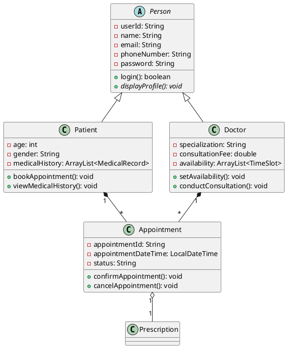
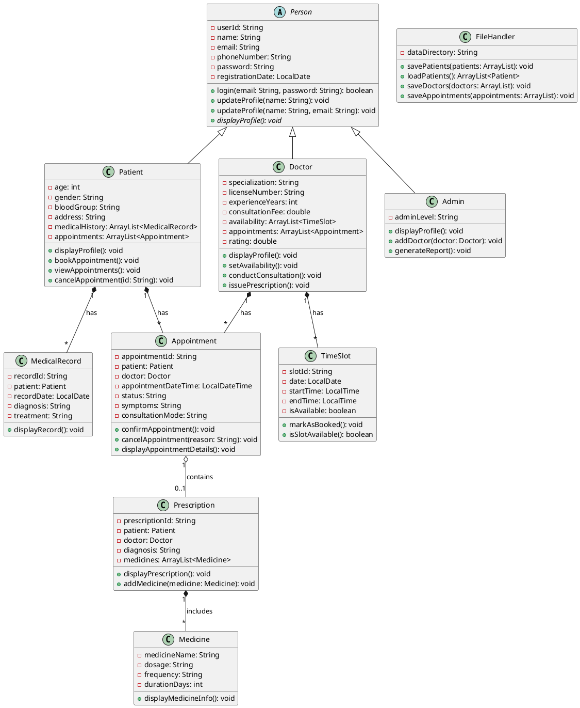

# Telemedicine & Remote Consultation System - Complete Project Guide

## Project Overview

**Project Name:** Telemedicine & Remote Consultation System  
**Platform:** CLI (Command Line Interface) - Java  
**Team Size:** 4 Persons  
**Duration:** 4 Weeks (April 6 - May 3, 2026)  
**Core Focus:** Appointment Scheduling & Doctor-Patient Interaction

---

## Table of Contents
1. [System Architecture Overview](#system-architecture-overview)
2. [Week 1: Design & Planning](#week-1-design--planning)
3. [Week 2: Core OOP Implementation](#week-2-core-oop-implementation)
4. [Week 3: Functionality & Features](#week-3-functionality--features)
5. [Week 4: Polishing & Presentation](#week-4-polishing--presentation)
6. [Team Distribution](#team-distribution)
7. [Testing Strategy](#testing-strategy)

---

## System Architecture Overview

### Problem Statement

**Current Healthcare Challenges:**
- Patients struggle to schedule appointments during limited working hours
- Long waiting times at clinics for routine consultations
- Geographical barriers prevent access to specialized doctors
- Manual appointment management leads to scheduling conflicts and errors
- Lack of centralized medical record access

**Proposed Solution:**
A CLI-based Telemedicine & Remote Consultation System that enables:
- 24/7 online appointment scheduling
- Virtual doctor-patient consultations
- Digital medical record management
- Automated appointment reminders
- Efficient queue management
- Prescription management

**Target Users:**
1. **Patients:** Schedule appointments, view medical history, receive prescriptions
2. **Doctors:** Manage schedules, conduct consultations, maintain patient records
3. **Admin:** Oversee system operations, manage users, generate reports

---

## Week 1: Design & Planning

### Problem Definition (Detailed)

**Title:** Telemedicine & Remote Consultation System

**Background:**  
Traditional healthcare systems face significant challenges in appointment management and patient access. Studies show that 51% of patients would consider leaving a practice due to long wait times, and 42% desire easier appointment booking. The COVID-19 pandemic has accelerated the need for remote healthcare solutions.

**Objectives:**
1. Eliminate geographical and time barriers to healthcare access
2. Reduce administrative burden through automation
3. Prevent scheduling conflicts with real-time availability checking
4. Maintain comprehensive digital medical records
5. Facilitate secure doctor-patient communication

**Scope:**
- User registration and authentication
- Role-based access (Patient, Doctor, Admin)
- Appointment scheduling with conflict prevention
- Medical record management
- Prescription issuance and tracking
- Basic reporting and analytics

---

### Class Design (10 Classes)

Based on telemedicine system best practices, here are the core classes:

#### 1. **Person (Abstract Class)**
- **Purpose:** Base class for all users
- **Type:** Abstract
- **Attributes:**
  - `String userId` (unique identifier)
  - `String name`
  - `String email`
  - `String phoneNumber`
  - `String password`
  - `LocalDate registrationDate`
- **Methods:**
  - `abstract void displayProfile()`
  - `boolean login(String email, String password)`
  - `void updateProfile(String name, String email, String phone)`
  - Getters and Setters

#### 2. **Patient (Extends Person)**
- **Purpose:** Represents a patient
- **Inheritance:** Extends Person
- **Attributes:**
  - `int age`
  - `String gender`
  - `String bloodGroup`
  - `String address`
  - `ArrayList<MedicalRecord> medicalHistory`
  - `ArrayList<Appointment> appointments`
- **Methods:**
  - `void displayProfile()` (Override)
  - `void bookAppointment(Doctor doctor, LocalDateTime dateTime, String symptoms)`
  - `void viewAppointments()`
  - `void viewMedicalHistory()`
  - `void cancelAppointment(String appointmentId)`

#### 3. **Doctor (Extends Person)**
- **Purpose:** Represents a doctor
- **Inheritance:** Extends Person
- **Attributes:**
  - `String specialization`
  - `String licenseNumber`
  - `int experienceYears`
  - `double consultationFee`
  - `ArrayList<TimeSlot> availability`
  - `ArrayList<Appointment> appointments`
  - `double rating`
  - `int totalRatings`
- **Methods:**
  - `void displayProfile()` (Override)
  - `void setAvailability(LocalDate date, LocalTime startTime, LocalTime endTime)`
  - `void viewAppointments(String status)` // pending, completed, cancelled
  - `void conductConsultation(Appointment appointment)`
  - `void issuePrescription(Patient patient, String diagnosis, String medicines)`
  - `ArrayList<TimeSlot> getAvailableSlots(LocalDate date)`

#### 4. **Admin (Extends Person)**
- **Purpose:** System administrator
- **Inheritance:** Extends Person
- **Attributes:**
  - `String adminLevel` (super_admin, admin)
- **Methods:**
  - `void displayProfile()` (Override)
  - `void addDoctor(Doctor doctor)`
  - `void removeDoctor(String doctorId)`
  - `void viewAllAppointments()`
  - `void generateReport(String reportType, LocalDate startDate, LocalDate endDate)`
  - `void manageUser(String userId, String action)` // activate, deactivate

#### 5. **Appointment**
- **Purpose:** Represents a consultation appointment
- **Composition:** Has Patient, Doctor, TimeSlot
- **Attributes:**
  - `String appointmentId`
  - `Patient patient`
  - `Doctor doctor`
  - `LocalDateTime appointmentDateTime`
  - `String symptoms`
  - `String status` // PENDING, CONFIRMED, COMPLETED, CANCELLED
  - `String consultationMode` // VIDEO, PHONE, CHAT
  - `LocalDateTime createdAt`
  - `Prescription prescription`
- **Methods:**
  - `void confirmAppointment()`
  - `void cancelAppointment(String reason)`
  - `void completeAppointment()`
  - `void displayAppointmentDetails()`
  - `String getAppointmentStatus()`
  - `boolean isWithin24Hours()`

#### 6. **TimeSlot**
- **Purpose:** Manages doctor availability
- **Attributes:**
  - `String slotId`
  - `LocalDate date`
  - `LocalTime startTime`
  - `LocalTime endTime`
  - `boolean isAvailable`
  - `Doctor doctor`
- **Methods:**
  - `void markAsBooked()`
  - `void markAsAvailable()`
  - `boolean isSlotAvailable()`
  - `boolean isConflict(TimeSlot otherSlot)`
  - `int getDurationInMinutes()`

#### 7. **Prescription**
- **Purpose:** Medical prescription details
- **Composition:** Part of Appointment
- **Attributes:**
  - `String prescriptionId`
  - `Patient patient`
  - `Doctor doctor`
  - `LocalDate issuedDate`
  - `String diagnosis`
  - `ArrayList<Medicine> medicines`
  - `String additionalNotes`
- **Methods:**
  - `void addMedicine(Medicine medicine)`
  - `void displayPrescription()`
  - `void generatePrescriptionReport()`

#### 8. **Medicine**
- **Purpose:** Medicine details in prescription
- **Attributes:**
  - `String medicineName`
  - `String dosage`
  - `String frequency` // Once daily, Twice daily, etc.
  - `int durationDays`
  - `String instructions` // After meals, Before sleep, etc.
- **Methods:**
  - `void displayMedicineInfo()`
  - `String getMedicineDetails()`

#### 9. **MedicalRecord**
- **Purpose:** Patient's medical history
- **Composition:** Belongs to Patient
- **Attributes:**
  - `String recordId`
  - `Patient patient`
  - `LocalDate recordDate`
  - `String diagnosis`
  - `String treatment`
  - `String doctorName`
  - `ArrayList<String> testResults`
  - `String notes`
- **Methods:**
  - `void displayRecord()`
  - `void addTestResult(String result)`
  - `void updateNotes(String notes)`

#### 10. **FileHandler**
- **Purpose:** Data persistence (File I/O)
- **Attributes:**
  - `String filePath`
- **Methods:**
  - `void savePatients(ArrayList<Patient> patients)`
  - `ArrayList<Patient> loadPatients()`
  - `void saveDoctors(ArrayList<Doctor> doctors)`
  - `ArrayList<Doctor> loadDoctors()`
  - `void saveAppointments(ArrayList<Appointment> appointments)`
  - `ArrayList<Appointment> loadAppointments()`
  - `void savePrescriptions(ArrayList<Prescription> prescriptions)`
  - `ArrayList<Prescription> loadPrescriptions()`

---

### Class Relationships

#### **Inheritance Relationships (IS-A)**
```
Person (Abstract)
   ├── Patient
   ├── Doctor
   └── Admin
```

**Explanation:**
- Patient **IS-A** Person
- Doctor **IS-A** Person
- Admin **IS-A** Person
- All share common attributes (name, email, phone) but have specialized behaviors

#### **Composition Relationships (HAS-A)**
```
Appointment HAS-A:
   ├── Patient
   ├── Doctor
   ├── TimeSlot
   └── Prescription

Patient HAS-A:
   ├── ArrayList<Appointment>
   └── ArrayList<MedicalRecord>

Doctor HAS-A:
   ├── ArrayList<TimeSlot>
   └── ArrayList<Appointment>

Prescription HAS-A:
   ├── Patient
   ├── Doctor
   └── ArrayList<Medicine>

MedicalRecord HAS-A:
   └── Patient
```

**Explanation:**
- Appointment is **composed of** Patient, Doctor, and TimeSlot
- Patient **has many** Appointments and MedicalRecords
- Doctor **has many** TimeSlots and Appointments
- Prescription **has many** Medicines

#### **Association Relationships**
```
Patient <---> Doctor (Many-to-Many through Appointments)
Doctor <---> TimeSlot (One-to-Many)
Patient <---> MedicalRecord (One-to-Many)
Appointment <---> Prescription (One-to-One)
```

---

### UML Class Diagram Structure

```
┌─────────────────────────────────────┐
│         <<abstract>>                │
│            Person                   │
├─────────────────────────────────────┤
│ - userId: String                    │
│ - name: String                      │
│ - email: String                     │
│ - phoneNumber: String               │
│ - password: String                  │
│ - registrationDate: LocalDate       │
├─────────────────────────────────────┤
│ + login(): boolean                  │
│ + updateProfile(): void             │
│ + displayProfile(): void {abstract} │
└─────────────────────────────────────┘
           △
           │
    ┌──────┴────────┐─────────┐
    │               │         │
┌───┴────┐    ┌────┴───┐  ┌──┴────┐
│Patient │    │ Doctor │  │ Admin │
└────────┘    └────────┘  └───────┘

┌──────────────────────────────────────┐
│          Appointment                 │
├──────────────────────────────────────┤
│ - appointmentId: String              │
│ - patient: Patient           ◆───────┤ (Composition)
│ - doctor: Doctor             ◆───────┤ (Composition)
│ - appointmentDateTime: LocalDateTime │
│ - status: String                     │
│ - symptoms: String                   │
├──────────────────────────────────────┤
│ + confirmAppointment(): void         │
│ + cancelAppointment(): void          │
│ + displayAppointmentDetails(): void  │
└──────────────────────────────────────┘
```

**Legend:**
- `△` = Inheritance
- `◆` = Composition (strong ownership)
- `◇` = Aggregation (weak ownership)
- `────>` = Association

---

### Deliverables for Week 1

#### 1. **Problem Definition Document** (1 page)
```
File: problem_definition.pdf
Contents:
- Problem Statement (150 words)
- Current System Issues (bullet points)
- Proposed Solution (100 words)
- System Objectives (5-7 points)
- Scope & Limitations
- Expected Benefits
```

#### 2. **Class List Document**
```
File: class_list.pdf
Contents:
For each of 10 classes:
- Class Name
- Purpose/Responsibility
- Type (Abstract/Concrete)
- Relationship to other classes
- Key attributes (3-5)
- Key methods (3-5)
```

#### 3. **UML Class Diagram**
```
Tool: draw.io, Lucidchart, PlantUML, or Microsoft Visio
File: uml_diagram.pdf

Must include:
- All 10 classes with proper notation
- Inheritance arrows
- Composition/Aggregation diamonds
- Association lines
- Multiplicities (1, *, 0..1, 1..*)
- Visibility markers (+, -, #)
- Method signatures
```

**Sample UML using PlantUML syntax:**


---

## Week 2: Core OOP Implementation

### Key Objectives
✅ Implement all 10 classes  
✅ Create abstract class Person  
✅ Implement inheritance hierarchy (Patient, Doctor, Admin)  
✅ Add constructors, getters/setters  
✅ Implement method overriding/overloading  
✅ Basic console interaction  

---

### Implementation Strategy

#### **Day 1-2: Foundation Classes**

**1. Person.java (Abstract Class)**
```java
package com.telemedicine.models;

import java.time.LocalDate;

public abstract class Person {
    // Attributes
    protected String userId;
    protected String name;
    protected String email;
    protected String phoneNumber;
    protected String password;
    protected LocalDate registrationDate;
    
    // Constructor
    public Person(String userId, String name, String email, 
                  String phoneNumber, String password) {
        this.userId = userId;
        this.name = name;
        this.email = email;
        this.phoneNumber = phoneNumber;
        this.password = password;
        this.registrationDate = LocalDate.now();
    }
    
    // Abstract method - must be implemented by subclasses
    public abstract void displayProfile();
    
    // Concrete method - shared by all subclasses
    public boolean login(String email, String password) {
        return this.email.equals(email) && this.password.equals(password);
    }
    
    // Method Overloading example
    public void updateProfile(String name) {
        this.name = name;
    }
    
    public void updateProfile(String name, String email) {
        this.name = name;
        this.email = email;
    }
    
    public void updateProfile(String name, String email, String phone) {
        this.name = name;
        this.email = email;
        this.phoneNumber = phone;
    }
    
    // Getters and Setters
    public String getUserId() { return userId; }
    public String getName() { return name; }
    public void setName(String name) { this.name = name; }
    public String getEmail() { return email; }
    public void setEmail(String email) { this.email = email; }
    public String getPhoneNumber() { return phoneNumber; }
    public void setPhoneNumber(String phoneNumber) { 
        this.phoneNumber = phoneNumber; 
    }
    public LocalDate getRegistrationDate() { return registrationDate; }
    
    // For file handling
    public String getPassword() { return password; }
    public void setPassword(String password) { this.password = password; }
}
```

**2. Patient.java**
```java
package com.telemedicine.models;

import java.time.LocalDateTime;
import java.util.ArrayList;

public class Patient extends Person {
    // Patient-specific attributes
    private int age;
    private String gender;
    private String bloodGroup;
    private String address;
    private ArrayList<MedicalRecord> medicalHistory;
    private ArrayList<Appointment> appointments;
    
    // Constructor
    public Patient(String userId, String name, String email, 
                   String phoneNumber, String password,
                   int age, String gender, String bloodGroup, String address) {
        // Call parent constructor
        super(userId, name, email, phoneNumber, password);
        this.age = age;
        this.gender = gender;
        this.bloodGroup = bloodGroup;
        this.address = address;
        this.medicalHistory = new ArrayList<>();
        this.appointments = new ArrayList<>();
    }
    
    // Override abstract method from Person
    @Override
    public void displayProfile() {
        System.out.println("\n========== PATIENT PROFILE ==========");
        System.out.println("Patient ID: " + userId);
        System.out.println("Name: " + name);
        System.out.println("Age: " + age);
        System.out.println("Gender: " + gender);
        System.out.println("Blood Group: " + bloodGroup);
        System.out.println("Email: " + email);
        System.out.println("Phone: " + phoneNumber);
        System.out.println("Address: " + address);
        System.out.println("Registered on: " + registrationDate);
        System.out.println("Total Appointments: " + appointments.size());
        System.out.println("====================================\n");
    }
    
    // Patient-specific methods
    public void bookAppointment(Doctor doctor, LocalDateTime dateTime, 
                                String symptoms, String mode) {
        String appointmentId = "APT" + System.currentTimeMillis();
        
        // Create new appointment
        Appointment appointment = new Appointment(
            appointmentId, this, doctor, dateTime, symptoms, mode
        );
        
        // Add to both patient and doctor's lists
        this.appointments.add(appointment);
        doctor.addAppointment(appointment);
        
        System.out.println("✓ Appointment booked successfully!");
        System.out.println("Appointment ID: " + appointmentId);
        System.out.println("Date & Time: " + dateTime);
        System.out.println("Doctor: Dr. " + doctor.getName());
        System.out.println("Specialization: " + doctor.getSpecialization());
    }
    
    public void viewAppointments() {
        if (appointments.isEmpty()) {
            System.out.println("No appointments found.");
            return;
        }
        
        System.out.println("\n===== YOUR APPOINTMENTS =====");
        for (int i = 0; i < appointments.size(); i++) {
            System.out.println("\n" + (i + 1) + ".");
            appointments.get(i).displayAppointmentDetails();
        }
    }
    
    public void viewMedicalHistory() {
        if (medicalHistory.isEmpty()) {
            System.out.println("No medical history available.");
            return;
        }
        
        System.out.println("\n===== MEDICAL HISTORY =====");
        for (MedicalRecord record : medicalHistory) {
            record.displayRecord();
            System.out.println("-------------------------");
        }
    }
    
    public void cancelAppointment(String appointmentId) {
        for (Appointment apt : appointments) {
            if (apt.getAppointmentId().equals(appointmentId)) {
                apt.cancelAppointment("Cancelled by patient");
                System.out.println("✓ Appointment cancelled successfully.");
                return;
            }
        }
        System.out.println("✗ Appointment not found.");
    }
    
    public void addMedicalRecord(MedicalRecord record) {
        this.medicalHistory.add(record);
    }
    
    // Getters and Setters
    public int getAge() { return age; }
    public void setAge(int age) { this.age = age; }
    public String getGender() { return gender; }
    public String getBloodGroup() { return bloodGroup; }
    public String getAddress() { return address; }
    public void setAddress(String address) { this.address = address; }
    public ArrayList<Appointment> getAppointments() { return appointments; }
    public ArrayList<MedicalRecord> getMedicalHistory() { 
        return medicalHistory; 
    }
}
```

**3. Doctor.java**
```java
package com.telemedicine.models;

import java.time.LocalDate;
import java.time.LocalTime;
import java.util.ArrayList;

public class Doctor extends Person {
    // Doctor-specific attributes
    private String specialization;
    private String licenseNumber;
    private int experienceYears;
    private double consultationFee;
    private ArrayList<TimeSlot> availability;
    private ArrayList<Appointment> appointments;
    private double rating;
    private int totalRatings;
    
    // Constructor
    public Doctor(String userId, String name, String email, 
                  String phoneNumber, String password,
                  String specialization, String licenseNumber,
                  int experienceYears, double consultationFee) {
        super(userId, name, email, phoneNumber, password);
        this.specialization = specialization;
        this.licenseNumber = licenseNumber;
        this.experienceYears = experienceYears;
        this.consultationFee = consultationFee;
        this.availability = new ArrayList<>();
        this.appointments = new ArrayList<>();
        this.rating = 0.0;
        this.totalRatings = 0;
    }
    
    // Override abstract method
    @Override
    public void displayProfile() {
        System.out.println("\n========== DOCTOR PROFILE ==========");
        System.out.println("Doctor ID: " + userId);
        System.out.println("Name: Dr. " + name);
        System.out.println("Specialization: " + specialization);
        System.out.println("License: " + licenseNumber);
        System.out.println("Experience: " + experienceYears + " years");
        System.out.println("Consultation Fee: Rs. " + consultationFee);
        System.out.println("Email: " + email);
        System.out.println("Phone: " + phoneNumber);
        if (totalRatings > 0) {
            System.out.printf("Rating: %.1f/5.0 (%d reviews)\n", 
                            rating, totalRatings);
        }
        System.out.println("Total Appointments: " + appointments.size());
        System.out.println("====================================\n");
    }
    
    // Set availability
    public void setAvailability(LocalDate date, LocalTime startTime, 
                               LocalTime endTime) {
        String slotId = "SLOT" + System.currentTimeMillis();
        TimeSlot slot = new TimeSlot(slotId, date, startTime, endTime, this);
        availability.add(slot);
        System.out.println("✓ Availability set for " + date);
    }
    
    // Get available slots for a date
    public ArrayList<TimeSlot> getAvailableSlots(LocalDate date) {
        ArrayList<TimeSlot> availableSlots = new ArrayList<>();
        for (TimeSlot slot : availability) {
            if (slot.getDate().equals(date) && slot.isSlotAvailable()) {
                availableSlots.add(slot);
            }
        }
        return availableSlots;
    }
    
    // View appointments by status
    public void viewAppointments(String status) {
        ArrayList<Appointment> filteredAppointments = new ArrayList<>();
        
        if (status.equalsIgnoreCase("ALL")) {
            filteredAppointments = appointments;
        } else {
            for (Appointment apt : appointments) {
                if (apt.getStatus().equalsIgnoreCase(status)) {
                    filteredAppointments.add(apt);
                }
            }
        }
        
        if (filteredAppointments.isEmpty()) {
            System.out.println("No " + status + " appointments found.");
            return;
        }
        
        System.out.println("\n===== " + status.toUpperCase() + 
                         " APPOINTMENTS =====");
        for (int i = 0; i < filteredAppointments.size(); i++) {
            System.out.println("\n" + (i + 1) + ".");
            filteredAppointments.get(i).displayAppointmentDetails();
        }
    }
    
    // Method overloading
    public void viewAppointments() {
        viewAppointments("ALL");
    }
    
    // Conduct consultation
    public void conductConsultation(Appointment appointment) {
        if (appointment.getStatus().equals("PENDING") || 
            appointment.getStatus().equals("CONFIRMED")) {
            appointment.completeAppointment();
            System.out.println("✓ Consultation completed.");
        } else {
            System.out.println("✗ Cannot conduct consultation. " +
                             "Appointment status: " + appointment.getStatus());
        }
    }
    
    // Issue prescription
    public void issuePrescription(Patient patient, String diagnosis, 
                                 ArrayList<Medicine> medicines, 
                                 String notes) {
        String prescriptionId = "PRE" + System.currentTimeMillis();
        Prescription prescription = new Prescription(
            prescriptionId, patient, this, diagnosis, medicines, notes
        );
        
        System.out.println("✓ Prescription issued successfully.");
        prescription.displayPrescription();
    }
    
    public void addAppointment(Appointment appointment) {
        this.appointments.add(appointment);
    }
    
    // Update rating
    public void addRating(double newRating) {
        double totalScore = rating * totalRatings;
        totalRatings++;
        rating = (totalScore + newRating) / totalRatings;
    }
    
    // Getters
    public String getSpecialization() { return specialization; }
    public String getLicenseNumber() { return licenseNumber; }
    public int getExperienceYears() { return experienceYears; }
    public double getConsultationFee() { return consultationFee; }
    public void setConsultationFee(double fee) { 
        this.consultationFee = fee; 
    }
    public double getRating() { return rating; }
    public int getTotalRatings() { return totalRatings; }
    public ArrayList<Appointment> getAppointments() { return appointments; }
    public ArrayList<TimeSlot> getAvailability() { return availability; }
}
```

#### **Day 3-4: Support Classes**

**4. Appointment.java**
```java
package com.telemedicine.models;

import java.time.LocalDateTime;
import java.time.format.DateTimeFormatter;

public class Appointment {
    // Attributes
    private String appointmentId;
    private Patient patient;
    private Doctor doctor;
    private LocalDateTime appointmentDateTime;
    private String symptoms;
    private String status; // PENDING, CONFIRMED, COMPLETED, CANCELLED
    private String consultationMode; // VIDEO, PHONE, CHAT
    private LocalDateTime createdAt;
    private Prescription prescription;
    
    // Constructor
    public Appointment(String appointmentId, Patient patient, Doctor doctor,
                      LocalDateTime appointmentDateTime, String symptoms,
                      String consultationMode) {
        this.appointmentId = appointmentId;
        this.patient = patient;
        this.doctor = doctor;
        this.appointmentDateTime = appointmentDateTime;
        this.symptoms = symptoms;
        this.consultationMode = consultationMode;
        this.status = "PENDING";
        this.createdAt = LocalDateTime.now();
        this.prescription = null;
    }
    
    // Methods
    public void confirmAppointment() {
        if (status.equals("PENDING")) {
            this.status = "CONFIRMED";
            System.out.println("Appointment confirmed.");
        } else {
            System.out.println("Cannot confirm. Current status: " + status);
        }
    }
    
    public void cancelAppointment(String reason) {
        if (!status.equals("COMPLETED")) {
            this.status = "CANCELLED";
            System.out.println("Appointment cancelled. Reason: " + reason);
        } else {
            System.out.println("Cannot cancel completed appointment.");
        }
    }
    
    public void completeAppointment() {
        if (status.equals("CONFIRMED") || status.equals("PENDING")) {
            this.status = "COMPLETED";
        }
    }
    
    public void displayAppointmentDetails() {
        DateTimeFormatter formatter = DateTimeFormatter.ofPattern(
            "dd-MM-yyyy HH:mm"
        );
        
        System.out.println("Appointment ID: " + appointmentId);
        System.out.println("Patient: " + patient.getName());
        System.out.println("Doctor: Dr. " + doctor.getName() + 
                         " (" + doctor.getSpecialization() + ")");
        System.out.println("Date & Time: " + 
                         appointmentDateTime.format(formatter));
        System.out.println("Mode: " + consultationMode);
        System.out.println("Status: " + status);
        System.out.println("Symptoms: " + symptoms);
        System.out.println("Fee: Rs. " + doctor.getConsultationFee());
    }
    
    public boolean isWithin24Hours() {
        LocalDateTime now = LocalDateTime.now();
        return appointmentDateTime.minusHours(24).isBefore(now) &&
               appointmentDateTime.isAfter(now);
    }
    
    // Getters and Setters
    public String getAppointmentId() { return appointmentId; }
    public Patient getPatient() { return patient; }
    public Doctor getDoctor() { return doctor; }
    public LocalDateTime getAppointmentDateTime() { 
        return appointmentDateTime; 
    }
    public String getStatus() { return status; }
    public void setStatus(String status) { this.status = status; }
    public String getSymptoms() { return symptoms; }
    public String getConsultationMode() { return consultationMode; }
    public Prescription getPrescription() { return prescription; }
    public void setPrescription(Prescription prescription) {
        this.prescription = prescription;
    }
    public LocalDateTime getCreatedAt() { return createdAt; }
}
```

**5. TimeSlot.java**
```java
package com.telemedicine.models;

import java.time.LocalDate;
import java.time.LocalTime;
import java.time.temporal.ChronoUnit;

public class TimeSlot {
    private String slotId;
    private LocalDate date;
    private LocalTime startTime;
    private LocalTime endTime;
    private boolean isAvailable;
    private Doctor doctor;
    
    public TimeSlot(String slotId, LocalDate date, LocalTime startTime,
                   LocalTime endTime, Doctor doctor) {
        this.slotId = slotId;
        this.date = date;
        this.startTime = startTime;
        this.endTime = endTime;
        this.isAvailable = true;
        this.doctor = doctor;
    }
    
    public void markAsBooked() {
        this.isAvailable = false;
    }
    
    public void markAsAvailable() {
        this.isAvailable = true;
    }
    
    public boolean isSlotAvailable() {
        // Check if slot is in the future
        LocalDate today = LocalDate.now();
        LocalTime now = LocalTime.now();
        
        if (date.isBefore(today)) {
            return false;
        }
        
        if (date.equals(today) && startTime.isBefore(now)) {
            return false;
        }
        
        return isAvailable;
    }
    
    public boolean isConflict(TimeSlot otherSlot) {
        if (!this.date.equals(otherSlot.date)) {
            return false;
        }
        
        // Check time overlap
        return !(this.endTime.isBefore(otherSlot.startTime) || 
                this.startTime.isAfter(otherSlot.endTime));
    }
    
    public int getDurationInMinutes() {
        return (int) ChronoUnit.MINUTES.between(startTime, endTime);
    }
    
    public void displaySlotInfo() {
        System.out.println("Slot: " + date + " | " + startTime + 
                         " - " + endTime + 
                         " | Status: " + (isAvailable ? "Available" : "Booked"));
    }
    
    // Getters
    public String getSlotId() { return slotId; }
    public LocalDate getDate() { return date; }
    public LocalTime getStartTime() { return startTime; }
    public LocalTime getEndTime() { return endTime; }
    public Doctor getDoctor() { return doctor; }
}
```

**6-10. Remaining Classes (Simplified for brevity)**

```java
// Medicine.java
public class Medicine {
    private String medicineName;
    private String dosage;
    private String frequency;
    private int durationDays;
    private String instructions;
    
    // Constructor, getters, displayMedicineInfo() method
}

// Prescription.java
public class Prescription {
    private String prescriptionId;
    private Patient patient;
    private Doctor doctor;
    private LocalDate issuedDate;
    private String diagnosis;
    private ArrayList<Medicine> medicines;
    private String additionalNotes;
    
    // Methods: addMedicine(), displayPrescription()
}

// MedicalRecord.java
public class MedicalRecord {
    private String recordId;
    private Patient patient;
    private LocalDate recordDate;
    private String diagnosis;
    private String treatment;
    private String doctorName;
    
    // Methods: displayRecord(), addTestResult()
}

// Admin.java (extends Person)
public class Admin extends Person {
    private String adminLevel;
    
    @Override
    public void displayProfile() { /* implementation */ }
    
    public void addDoctor(Doctor doctor) { /* implementation */ }
    public void generateReport() { /* implementation */ }
}

// FileHandler.java
public class FileHandler {
    private String filePath;
    
    public void saveData(Object data, String filename) { /* implementation */ }
    public Object loadData(String filename) { /* implementation */ }
}
```

---

### Testing Week 2 Deliverables

**Main.java (Basic Console Interaction)**
```java
package com.telemedicine;

import com.telemedicine.models.*;
import java.time.LocalDate;
import java.time.LocalDateTime;
import java.time.LocalTime;
import java.util.ArrayList;
import java.util.Scanner;

public class Main {
    public static void main(String[] args) {
        Scanner scanner = new Scanner(System.in);
        
        // Test data
        Patient patient1 = new Patient(
            "P001", "Ahmed Ali", "ahmed@email.com", 
            "0300-1234567", "pass123",
            28, "Male", "B+", "Rawalpindi"
        );
        
        Doctor doctor1 = new Doctor(
            "D001", "Fatima Khan", "fatima@email.com",
            "0301-9876543", "doc123",
            "Cardiologist", "PMC-12345", 10, 2000.0
        );
        
        // Set doctor availability
        doctor1.setAvailability(
            LocalDate.now().plusDays(1),
            LocalTime.of(10, 0),
            LocalTime.of(18, 0)
        );
        
        // Display profiles
        patient1.displayProfile();
        doctor1.displayProfile();
        
        // Book appointment
        patient1.bookAppointment(
            doctor1,
            LocalDateTime.now().plusDays(1).withHour(14).withMinute(0),
            "Chest pain and irregular heartbeat",
            "VIDEO"
        );
        
        // View appointments
        patient1.viewAppointments();
        doctor1.viewAppointments("PENDING");
        
        System.out.println("\n✓ Week 2 Implementation Test Successful!");
        scanner.close();
    }
}
```

**Expected Output:**
```
========== PATIENT PROFILE ==========
Patient ID: P001
Name: Ahmed Ali
Age: 28
Gender: Male
Blood Group: B+
Email: ahmed@email.com
Phone: 0300-1234567
Address: Rawalpindi
Registered on: 2026-04-10
Total Appointments: 1
====================================

✓ Appointment booked successfully!
Appointment ID: APT1712745600000
...
```

---

## Week 3: Functionality & Features

### Objectives
✅ Build menu-driven system  
✅ Implement full logic (Input → Process → Output)  
✅ Add file handling (save/load data)  
✅ Add exception handling  
✅ Improve user interaction  

---

### Menu-Driven System Architecture

**Main Menu Structure:**
```
╔═══════════════════════════════════════════╗
║   TELEMEDICINE SYSTEM - MAIN MENU        ║
╠═══════════════════════════════════════════╣
║  1. Patient Login                         ║
║  2. Doctor Login                          ║
║  3. Admin Login                           ║
║  4. New Patient Registration              ║
║  5. Exit                                  ║
╚═══════════════════════════════════════════╝
```

**Patient Menu:**
```
╔═══════════════════════════════════════════╗
║   PATIENT DASHBOARD                       ║
╠═══════════════════════════════════════════╣
║  1. View Profile                          ║
║  2. Update Profile                        ║
║  3. Search Doctors                        ║
║  4. Book Appointment                      ║
║  5. View My Appointments                  ║
║  6. Cancel Appointment                    ║
║  7. View Medical History                  ║
║  8. View Prescriptions                    ║
║  9. Logout                                ║
╚═══════════════════════════════════════════╝
```

**Doctor Menu:**
```
╔═══════════════════════════════════════════╗
║   DOCTOR DASHBOARD                        ║
╠═══════════════════════════════════════════╣
║  1. View Profile                          ║
║  2. Set Availability                      ║
║  3. View All Appointments                 ║
║  4. View Pending Appointments             ║
║  5. View Today's Appointments             ║
║  6. Conduct Consultation                  ║
║  7. Issue Prescription                    ║
║  8. View Patient History                  ║
║  9. Logout                                ║
╚═══════════════════════════════════════════╝
```

---

### Implementation Example

**TelemedicineSystem.java (Main Controller)**
```java
package com.telemedicine;

import com.telemedicine.models.*;
import com.telemedicine.utils.*;
import java.util.*;
import java.time.*;
import java.time.format.DateTimeFormatter;

public class TelemedicineSystem {
    // Data storage
    private ArrayList<Patient> patients;
    private ArrayList<Doctor> doctors;
    private ArrayList<Admin> admins;
    private ArrayList<Appointment> appointments;
    private FileHandler fileHandler;
    private Scanner scanner;
    
    // Current logged-in user
    private Person currentUser;
    private String currentUserType;
    
    public TelemedicineSystem() {
        this.patients = new ArrayList<>();
        this.doctors = new ArrayList<>();
        this.admins = new ArrayList<>();
        this.appointments = new ArrayList<>();
        this.fileHandler = new FileHandler();
        this.scanner = new Scanner(System.in);
        
        // Load data from files
        loadAllData();
        
        // Add sample data if empty
        if (doctors.isEmpty()) {
            addSampleData();
        }
    }
    
    public void start() {
        while (true) {
            try {
                displayMainMenu();
                int choice = getIntInput("Enter your choice: ");
                
                switch (choice) {
                    case 1:
                        patientLogin();
                        break;
                    case 2:
                        doctorLogin();
                        break;
                    case 3:
                        adminLogin();
                        break;
                    case 4:
                        registerPatient();
                        break;
                    case 5:
                        saveAllData();
                        System.out.println("\nThank you for using " +
                                         "Telemedicine System!");
                        System.exit(0);
                    default:
                        System.out.println("Invalid choice. Try again.");
                }
            } catch (Exception e) {
                System.out.println("Error: " + e.getMessage());
                scanner.nextLine(); // Clear buffer
            }
        }
    }
    
    private void displayMainMenu() {
        clearScreen();
        System.out.println("\n╔════════════════════════════════════════╗");
        System.out.println("║   TELEMEDICINE & REMOTE CONSULTATION   ║");
        System.out.println("║              SYSTEM v1.0               ║");
        System.out.println("╠════════════════════════════════════════╣");
        System.out.println("║  1. Patient Login                      ║");
        System.out.println("║  2. Doctor Login                       ║");
        System.out.println("║  3. Admin Login                        ║");
        System.out.println("║  4. New Patient Registration           ║");
        System.out.println("║  5. Exit                               ║");
        System.out.println("╚════════════════════════════════════════╝\n");
    }
    
    private void patientLogin() {
        System.out.println("\n===== PATIENT LOGIN =====");
        System.out.print("Email: ");
        String email = scanner.nextLine().trim();
        System.out.print("Password: ");
        String password = scanner.nextLine().trim();
        
        for (Patient patient : patients) {
            if (patient.login(email, password)) {
                currentUser = patient;
                currentUserType = "PATIENT";
                System.out.println("\n✓ Login successful! Welcome, " + 
                                 patient.getName());
                pauseScreen();
                patientDashboard();
                return;
            }
        }
        
        System.out.println("\n✗ Invalid credentials. Please try again.");
        pauseScreen();
    }
    
    private void patientDashboard() {
        Patient patient = (Patient) currentUser;
        
        while (true) {
            try {
                clearScreen();
                System.out.println("\n╔════════════════════════════════════════╗");
                System.out.println("║       PATIENT DASHBOARD                ║");
                System.out.println("║  Welcome, " + 
                                 String.format("%-29s", patient.getName()) + "║");
                System.out.println("╠════════════════════════════════════════╣");
                System.out.println("║  1. View Profile                       ║");
                System.out.println("║  2. Update Profile                     ║");
                System.out.println("║  3. Search Doctors                     ║");
                System.out.println("║  4. Book Appointment                   ║");
                System.out.println("║  5. View My Appointments               ║");
                System.out.println("║  6. Cancel Appointment                 ║");
                System.out.println("║  7. View Medical History               ║");
                System.out.println("║  8. Logout                             ║");
                System.out.println("╚════════════════════════════════════════╝\n");
                
                int choice = getIntInput("Enter your choice: ");
                
                switch (choice) {
                    case 1:
                        patient.displayProfile();
                        pauseScreen();
                        break;
                    case 2:
                        updatePatientProfile(patient);
                        break;
                    case 3:
                        searchDoctors();
                        pauseScreen();
                        break;
                    case 4:
                        bookAppointment(patient);
                        break;
                    case 5:
                        patient.viewAppointments();
                        pauseScreen();
                        break;
                    case 6:
                        cancelAppointment(patient);
                        break;
                    case 7:
                        patient.viewMedicalHistory();
                        pauseScreen();
                        break;
                    case 8:
                        currentUser = null;
                        currentUserType = null;
                        System.out.println("\n✓ Logged out successfully.");
                        pauseScreen();
                        return;
                    default:
                        System.out.println("Invalid choice.");
                        pauseScreen();
                }
            } catch (Exception e) {
                System.out.println("Error: " + e.getMessage());
                scanner.nextLine();
                pauseScreen();
            }
        }
    }
    
    private void bookAppointment(Patient patient) {
        System.out.println("\n===== BOOK APPOINTMENT =====");
        
        // Display available doctors
        if (doctors.isEmpty()) {
            System.out.println("No doctors available at the moment.");
            pauseScreen();
            return;
        }
        
        System.out.println("\nAvailable Doctors:");
        for (int i = 0; i < doctors.size(); i++) {
            System.out.println((i + 1) + ". Dr. " + 
                             doctors.get(i).getName() + 
                             " - " + doctors.get(i).getSpecialization() +
                             " (Rs. " + doctors.get(i).getConsultationFee() + 
                             ")");
        }
        
        int doctorChoice = getIntInput("\nSelect doctor (1-" + 
                                      doctors.size() + "): ");
        
        if (doctorChoice < 1 || doctorChoice > doctors.size()) {
            System.out.println("Invalid selection.");
            pauseScreen();
            return;
        }
        
        Doctor selectedDoctor = doctors.get(doctorChoice - 1);
        
        // Get appointment date
        System.out.print("Enter date (DD-MM-YYYY): ");
        String dateStr = scanner.nextLine();
        LocalDate appointmentDate;
        
        try {
            DateTimeFormatter formatter = DateTimeFormatter.ofPattern(
                "dd-MM-yyyy"
            );
            appointmentDate = LocalDate.parse(dateStr, formatter);
            
            // Check if date is in the future
            if (appointmentDate.isBefore(LocalDate.now())) {
                System.out.println("Cannot book appointment in the past.");
                pauseScreen();
                return;
            }
        } catch (Exception e) {
            System.out.println("Invalid date format.");
            pauseScreen();
            return;
        }
        
        // Show available time slots
        ArrayList<TimeSlot> availableSlots = 
            selectedDoctor.getAvailableSlots(appointmentDate);
        
        if (availableSlots.isEmpty()) {
            System.out.println("\nNo available slots for this date.");
            pauseScreen();
            return;
        }
        
        System.out.println("\nAvailable Time Slots:");
        for (int i = 0; i < availableSlots.size(); i++) {
            TimeSlot slot = availableSlots.get(i);
            System.out.println((i + 1) + ". " + 
                             slot.getStartTime() + " - " + 
                             slot.getEndTime());
        }
        
        int slotChoice = getIntInput("\nSelect time slot: ");
        
        if (slotChoice < 1 || slotChoice > availableSlots.size()) {
            System.out.println("Invalid selection.");
            pauseScreen();
            return;
        }
        
        TimeSlot selectedSlot = availableSlots.get(slotChoice - 1);
        
        // Get symptoms
        System.out.print("Describe your symptoms: ");
        String symptoms = scanner.nextLine();
        
        // Select consultation mode
        System.out.println("\nConsultation Mode:");
        System.out.println("1. Video Call");
        System.out.println("2. Phone Call");
        System.out.println("3. Chat");
        
        int modeChoice = getIntInput("Select mode: ");
        String mode;
        
        switch (modeChoice) {
            case 1: mode = "VIDEO"; break;
            case 2: mode = "PHONE"; break;
            case 3: mode = "CHAT"; break;
            default:
                System.out.println("Invalid choice. Defaulting to VIDEO.");
                mode = "VIDEO";
        }
        
        // Create appointment
        LocalDateTime appointmentDateTime = LocalDateTime.of(
            appointmentDate,
            selectedSlot.getStartTime()
        );
        
        patient.bookAppointment(selectedDoctor, appointmentDateTime, 
                              symptoms, mode);
        selectedSlot.markAsBooked();
        
        // Add to system's appointment list
        Appointment newAppointment = patient.getAppointments()
                                           .get(patient.getAppointments()
                                           .size() - 1);
        appointments.add(newAppointment);
        
        pauseScreen();
    }
    
    // Exception Handling Example
    private int getIntInput(String prompt) {
        while (true) {
            try {
                System.out.print(prompt);
                int value = Integer.parseInt(scanner.nextLine().trim());
                return value;
            } catch (NumberFormatException e) {
                System.out.println("✗ Please enter a valid number.");
            }
        }
    }
    
    // Utility methods
    private void clearScreen() {
        // For Windows
        try {
            new ProcessBuilder("cmd", "/c", "cls")
                .inheritIO().start().waitFor();
        } catch (Exception e) {
            // For Unix/Linux/Mac
            System.out.print("\033[H\033[2J");
            System.out.flush();
        }
    }
    
    private void pauseScreen() {
        System.out.print("\nPress Enter to continue...");
        scanner.nextLine();
    }
    
    // File handling methods
    private void saveAllData() {
        System.out.println("\nSaving data...");
        fileHandler.savePatients(patients);
        fileHandler.saveDoctors(doctors);
        fileHandler.saveAppointments(appointments);
        System.out.println("✓ Data saved successfully.");
    }
    
    private void loadAllData() {
        System.out.println("Loading data...");
        patients = fileHandler.loadPatients();
        doctors = fileHandler.loadDoctors();
        appointments = fileHandler.loadAppointments();
        System.out.println("✓ Data loaded successfully.");
    }
    
    // Add sample data for testing
    private void addSampleData() {
        // Add sample doctors
        Doctor doc1 = new Doctor("D001", "Fatima Khan", 
            "fatima@hospital.com", "0301-1111111", "doc123",
            "Cardiologist", "PMC-12345", 10, 2000.0);
        
        Doctor doc2 = new Doctor("D002", "Ali Raza",
            "ali@hospital.com", "0302-2222222", "doc123",
            "Dermatologist", "PMC-12346", 8, 1500.0);
        
        Doctor doc3 = new Doctor("D003", "Sara Ahmed",
            "sara@hospital.com", "0303-3333333", "doc123",
            "Pediatrician", "PMC-12347", 12, 1800.0);
        
        // Set availability for next 7 days
        for (int i = 1; i <= 7; i++) {
            doc1.setAvailability(LocalDate.now().plusDays(i),
                               LocalTime.of(9, 0), LocalTime.of(17, 0));
            doc2.setAvailability(LocalDate.now().plusDays(i),
                               LocalTime.of(10, 0), LocalTime.of(16, 0));
            doc3.setAvailability(LocalDate.now().plusDays(i),
                               LocalTime.of(8, 0), LocalTime.of(14, 0));
        }
        
        doctors.add(doc1);
        doctors.add(doc2);
        doctors.add(doc3);
        
        // Add sample admin
        Admin admin = new Admin("A001", "Admin", "admin@system.com",
                              "0300-0000000", "admin123", "super_admin");
        admins.add(admin);
        
        // Add sample patient for testing
        Patient testPatient = new Patient("P001", "Ahmed Ali",
            "ahmed@email.com", "0300-1234567", "pass123",
            28, "Male", "B+", "Rawalpindi");
        patients.add(testPatient);
        
        System.out.println("✓ Sample data added.");
    }
}
```

**FileHandler.java (Complete Implementation)**
```java
package com.telemedicine.utils;

import com.telemedicine.models.*;
import java.io.*;
import java.util.ArrayList;
import java.time.*;

public class FileHandler {
    private String dataDirectory = "data/";
    
    public FileHandler() {
        // Create data directory if it doesn't exist
        File dir = new File(dataDirectory);
        if (!dir.exists()) {
            dir.mkdirs();
        }
    }
    
    // Save patients
    public void savePatients(ArrayList<Patient> patients) {
        try (ObjectOutputStream oos = new ObjectOutputStream(
                new FileOutputStream(dataDirectory + "patients.dat"))) {
            oos.writeObject(patients);
        } catch (IOException e) {
            System.out.println("Error saving patients: " + e.getMessage());
        }
    }
    
    // Load patients
    @SuppressWarnings("unchecked")
    public ArrayList<Patient> loadPatients() {
        try (ObjectInputStream ois = new ObjectInputStream(
                new FileInputStream(dataDirectory + "patients.dat"))) {
            return (ArrayList<Patient>) ois.readObject();
        } catch (FileNotFoundException e) {
            System.out.println("No existing patient data found.");
            return new ArrayList<>();
        } catch (IOException | ClassNotFoundException e) {
            System.out.println("Error loading patients: " + e.getMessage());
            return new ArrayList<>();
        }
    }
    
    // Save doctors
    public void saveDoctors(ArrayList<Doctor> doctors) {
        try (ObjectOutputStream oos = new ObjectOutputStream(
                new FileOutputStream(dataDirectory + "doctors.dat"))) {
            oos.writeObject(doctors);
        } catch (IOException e) {
            System.out.println("Error saving doctors: " + e.getMessage());
        }
    }
    
    // Load doctors
    @SuppressWarnings("unchecked")
    public ArrayList<Doctor> loadDoctors() {
        try (ObjectInputStream ois = new ObjectInputStream(
                new FileInputStream(dataDirectory + "doctors.dat"))) {
            return (ArrayList<Doctor>) ois.readObject();
        } catch (FileNotFoundException e) {
            System.out.println("No existing doctor data found.");
            return new ArrayList<>();
        } catch (IOException | ClassNotFoundException e) {
            System.out.println("Error loading doctors: " + e.getMessage());
            return new ArrayList<>();
        }
    }
    
    // Save appointments
    public void saveAppointments(ArrayList<Appointment> appointments) {
        try (ObjectOutputStream oos = new ObjectOutputStream(
                new FileOutputStream(dataDirectory + "appointments.dat"))) {
            oos.writeObject(appointments);
        } catch (IOException e) {
            System.out.println("Error saving appointments: " + 
                             e.getMessage());
        }
    }
    
    // Load appointments
    @SuppressWarnings("unchecked")
    public ArrayList<Appointment> loadAppointments() {
        try (ObjectInputStream ois = new ObjectInputStream(
                new FileInputStream(dataDirectory + "appointments.dat"))) {
            return (ArrayList<Appointment>) ois.readObject();
        } catch (FileNotFoundException e) {
            System.out.println("No existing appointment data found.");
            return new ArrayList<>();
        } catch (IOException | ClassNotFoundException e) {
            System.out.println("Error loading appointments: " + 
                             e.getMessage());
            return new ArrayList<>();
        }
    }
}
```

**Note:** To make classes serializable for file I/O:
```java
import java.io.Serializable;

public class Patient extends Person implements Serializable {
    private static final long serialVersionUID = 1L;
    // ... rest of code
}
```

---

## Week 4: Polishing & Presentation

### Code Cleanup Checklist

✅ **Indentation & Formatting**
- Use consistent 4-space indentation
- Add blank lines between methods
- Align braces properly
- Use meaningful variable names

✅ **Naming Conventions**
- Classes: PascalCase (e.g., `Patient`, `Appointment`)
- Methods: camelCase (e.g., `bookAppointment()`)
- Constants: UPPER_SNAKE_CASE (e.g., `MAX_APPOINTMENTS`)
- Variables: camelCase (e.g., `patientName`)

✅ **Comments & Documentation**
```java
/**
 * Represents a patient in the telemedicine system.
 * Extends the Person class and adds patient-specific attributes.
 * 
 * @author Team [Your Team Name]
 * @version 1.0
 * @since 2026-04-06
 */
public class Patient extends Person {
    
    /**
     * Books a new appointment with a doctor.
     * 
     * @param doctor The doctor to book with
     * @param dateTime The appointment date and time
     * @param symptoms Patient's symptoms description
     * @param mode Consultation mode (VIDEO, PHONE, CHAT)
     * @throws IllegalArgumentException if appointment is in the past
     */
    public void bookAppointment(Doctor doctor, LocalDateTime dateTime,
                              String symptoms, String mode) {
        // Implementation
    }
}
```

### Final UML Diagram

Update your UML to reflect all implemented relationships:



### Project Report Structure

**File: Project_Report.docx (10-15 pages)**

```
TELEMEDICINE & REMOTE CONSULTATION SYSTEM
Project Report

TABLE OF CONTENTS
1. Executive Summary
2. Introduction
   2.1 Background
   2.2 Problem Statement
   2.3 Objectives
   2.4 Scope
3. System Design
   3.1 Architecture Overview
   3.2 Class Diagram
   3.3 Use Case Diagram
   3.4 Relationships
      - Inheritance
      - Composition
      - Association
4. Implementation
   4.1 Technology Stack
   4.2 Class Descriptions
   4.3 Key Features
   4.4 File Handling
   4.5 Exception Handling
5. OOP Concepts Applied
   5.1 Abstraction
   5.2 Encapsulation
   5.3 Inheritance
   5.4 Polymorphism
   5.5 Method Overloading/Overriding
6. Testing & Results
   6.1 Test Cases
   6.2 Screenshots
   6.3 Sample Output
7. Challenges & Solutions
8. Future Enhancements
9. Conclusion
10. References
11. Appendices
    - Code Listings
    - User Manual
```

### Presentation Slides (8-10 slides)

**Slide 1: Title Slide**
```
TELEMEDICINE & REMOTE CONSULTATION SYSTEM
A Java-based CLI Application

Team Members:
- [Name 1] - [Roll No]
- [Name 2] - [Roll No]
- [Name 3] - [Roll No]
- [Name 4] - [Roll No]

Course: Object-Oriented Programming
Date: [Submission Date]
```

**Slide 2: Problem Statement**
```
HEALTHCARE CHALLENGES
• 51% patients leave due to long wait times
• Limited access during working hours
• Manual scheduling causes conflicts
• Geographical barriers to specialists

OUR SOLUTION
24/7 appointment scheduling system with:
✓ Role-based access (Patient/Doctor/Admin)
✓ Real-time availability checking
✓ Digital medical records
✓ Prescription management
```

**Slide 3: System Architecture**
```
ARCHITECTURE OVERVIEW

[Include UML diagram image]

• 10 Classes
• 3-tier inheritance (Person → Patient/Doctor/Admin)
• Composition & Association relationships
• File-based persistence
```

**Slide 4: OOP Concepts**
```
OOP PRINCIPLES APPLIED

1. ABSTRACTION
   → Person (abstract class)

2. ENCAPSULATION
   → Private attributes + public getters/setters

3. INHERITANCE
   → Patient, Doctor, Admin extend Person

4. POLYMORPHISM
   → Method overriding (displayProfile)
   → Method overloading (updateProfile)
```

**Slide 5: Key Features**
```
SYSTEM FEATURES

PATIENT MODULE
• Register & Login
• Search doctors by specialization
• Book appointments
• View medical history

DOCTOR MODULE
• Set availability
• View appointments
• Conduct consultations
• Issue prescriptions

ADMIN MODULE
• Manage users
• Generate reports
```

**Slide 6: Live Demo**
```
SYSTEM DEMONSTRATION

[Include screenshots of:]
1. Main Menu
2. Patient Dashboard
3. Booking Appointment
4. Viewing Appointments
5. Doctor Consultation
```

**Slide 7: Technical Highlights**
```
IMPLEMENTATION DETAILS

• Language: Java (JDK 11+)
• Data Structures: ArrayList, HashMap
• File I/O: Serialization
• Exception Handling: Try-catch blocks
• Validation: Input checking

LINES OF CODE: ~2000+
CLASSES: 10
METHODS: 50+
```

**Slide 8: Challenges & Solutions**
```
CHALLENGES FACED

Challenge 1: File serialization with relationships
Solution: Implemented Serializable interface properly

Challenge 2: Preventing double booking
Solution: Real-time slot availability checking

Challenge 3: Date/time validation
Solution: LocalDateTime with custom validators
```

**Slide 9: Future Enhancements**
```
FUTURE SCOPE

✓ GUI using JavaFX/Swing
✓ Database integration (MySQL)
✓ Payment gateway
✓ SMS/Email notifications
✓ Video consultation integration
✓ AI-based symptom checker
```

**Slide 10: Thank You**
```
THANK YOU

Questions?

Contact:
[Team Email]
[GitHub Repository]
```

---

## Team Distribution (4 Members)

### Member 1: Lead Developer (Patient Module)
**Responsibilities:**
- Implement Patient class
- Patient dashboard menu
- Appointment booking logic
- Patient-related file handling
- Testing patient workflows

**Deliverables:**
- Patient.java (complete)
- Patient menu methods
- Test cases for patient operations

### Member 2: Doctor Module Developer
**Responsibilities:**
- Implement Doctor class
- Doctor dashboard menu
- Availability management
- Consultation & prescription logic
- Doctor-related features

**Deliverables:**
- Doctor.java (complete)
- TimeSlot.java
- Prescription.java
- Medicine.java

### Member 3: Core System & Admin
**Responsibilities:**
- Implement Person (abstract class)
- Admin class
- Appointment class
- Main menu system
- System integration

**Deliverables:**
- Person.java
- Admin.java
- Appointment.java
- Main system controller

### Member 4: Data Management & Documentation
**Responsibilities:**
- FileHandler implementation
- MedicalRecord class
- Exception handling
- UML diagrams
- Documentation & report

**Deliverables:**
- FileHandler.java
- MedicalRecord.java
- UML diagrams
- Project report
- Presentation slides

---

## Testing Strategy

### Test Cases

**TC-001: Patient Registration**
```
Input: Valid patient details
Expected: Patient successfully registered
Status: Pass/Fail
```

**TC-002: Doctor Login**
```
Input: Valid email & password
Expected: Login successful, dashboard displayed
Status: Pass/Fail
```

**TC-003: Book Appointment**
```
Input: Select doctor, date, time, symptoms
Expected: Appointment created, slot marked as booked
Status: Pass/Fail
```

**TC-004: Cancel Appointment**
```
Input: Valid appointment ID
Expected: Appointment status changed to CANCELLED
Status: Pass/Fail
```

**TC-005: File Persistence**
```
Input: Save data and restart program
Expected: Data successfully loaded
Status: Pass/Fail
```

### Exception Handling Test Cases

**EH-001: Invalid Date Format**
```java
try {
    LocalDate date = LocalDate.parse(userInput, formatter);
} catch (DateTimeParseException e) {
    System.out.println("Invalid date format. Use DD-MM-YYYY");
}
```

**EH-002: Duplicate Booking**
```java
if (isSlotBooked(doctor, dateTime)) {
    throw new AppointmentException("Slot already booked");
}
```

**EH-003: File Not Found**
```java
try {
    loadData();
} catch (FileNotFoundException e) {
    System.out.println("Creating new data files...");
    initializeDefaultData();
}
```

---

## Important Data Types & Attributes Summary

### Common Java Data Types Used

**Primitive Types:**
- `int` - age, experienceYears, durationDays
- `double` - consultationFee, rating
- `boolean` - isAvailable

**Reference Types:**
- `String` - userId, name, email, password, etc.
- `LocalDate` - registrationDate, appointmentDate
- `LocalDateTime` - appointmentDateTime, createdAt
- `LocalTime` - startTime, endTime
- `ArrayList<T>` - appointments, medicalHistory, medicines

### Key Attributes by Class

**Person:**
- String userId, name, email, phoneNumber, password
- LocalDate registrationDate

**Patient:**
- int age
- String gender, bloodGroup, address
- ArrayList<MedicalRecord> medicalHistory
- ArrayList<Appointment> appointments

**Doctor:**
- String specialization, licenseNumber
- int experienceYears
- double consultationFee, rating
- ArrayList<TimeSlot> availability
- ArrayList<Appointment> appointments

**Appointment:**
- String appointmentId, status, symptoms, consultationMode
- Patient patient
- Doctor doctor
- LocalDateTime appointmentDateTime
- Prescription prescription

---

## Conclusion

This comprehensive guide covers all aspects of your Telemedicine project across 4 weeks:

**Week 1:** Complete design with UML and class relationships  
**Week 2:** Full OOP implementation with inheritance and composition  
**Week 3:** Menu-driven system with file handling and exceptions  
**Week 4:** Polished code, documentation, and presentation

The system demonstrates:
- ✅ Abstraction (Person abstract class)
- ✅ Encapsulation (private attributes + getters/setters)
- ✅ Inheritance (Patient/Doctor/Admin extend Person)
- ✅ Polymorphism (method overriding and overloading)
- ✅ Composition (Appointment has Patient, Doctor, etc.)
- ✅ File I/O for persistence
- ✅ Exception handling
- ✅ Real-world healthcare application

Good luck with your project! 🚀
